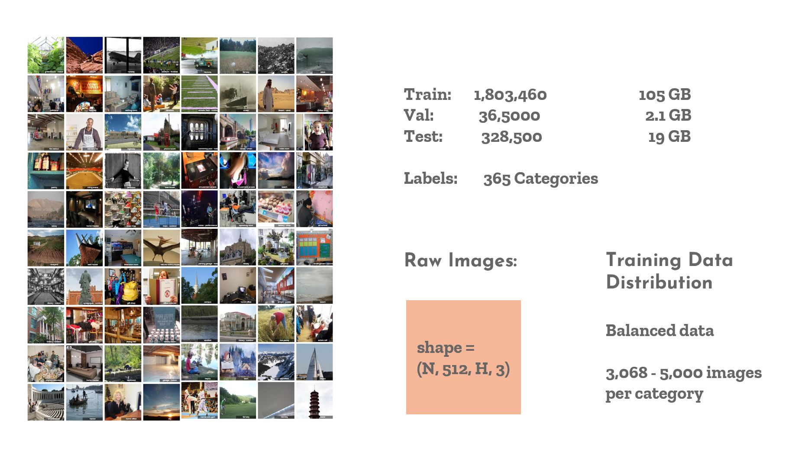
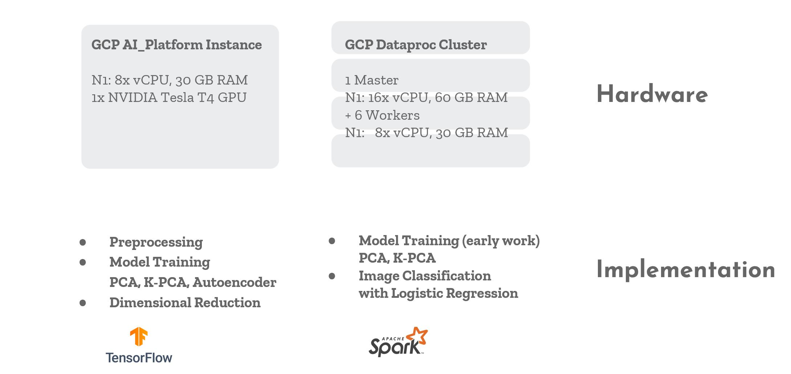
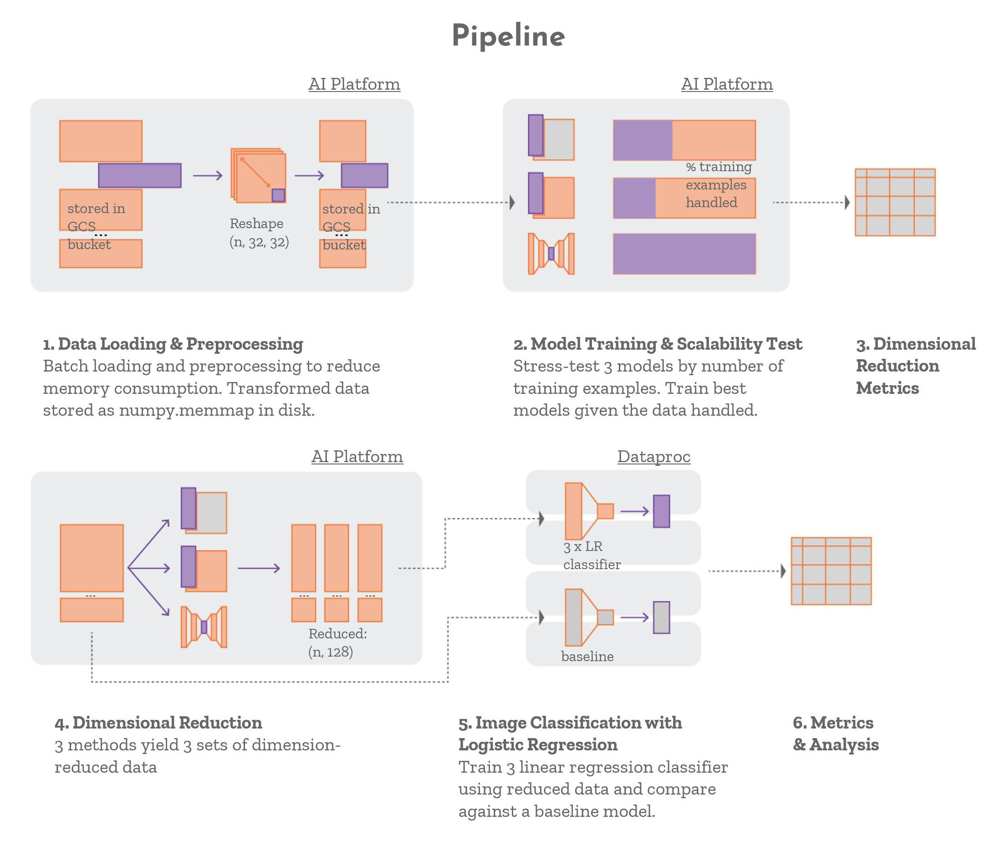
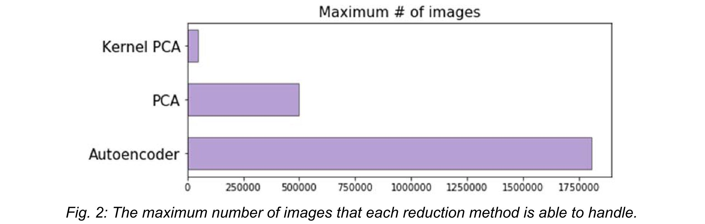
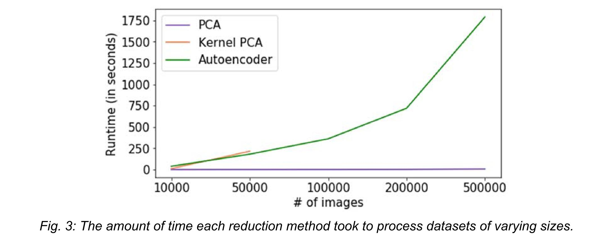
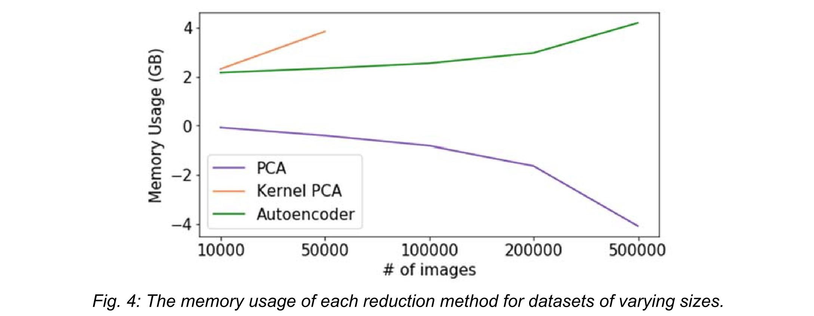
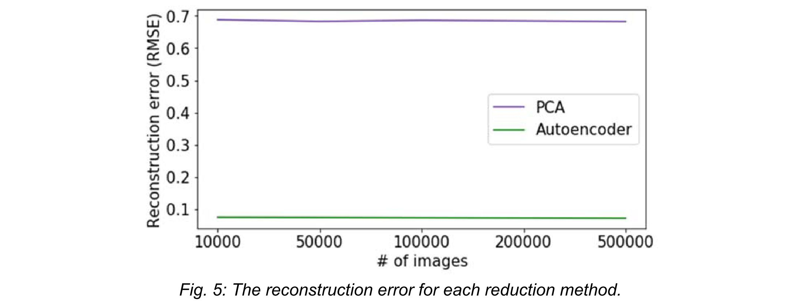
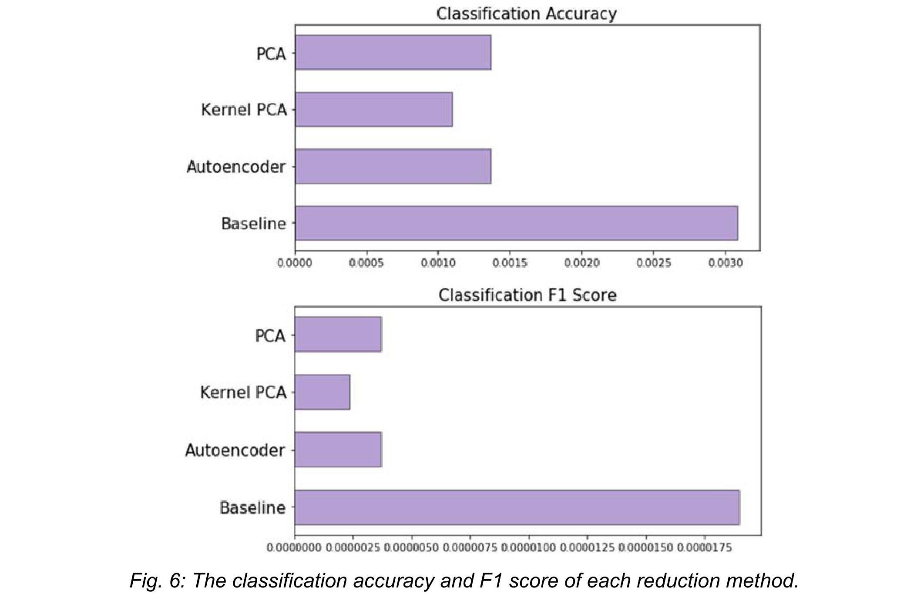
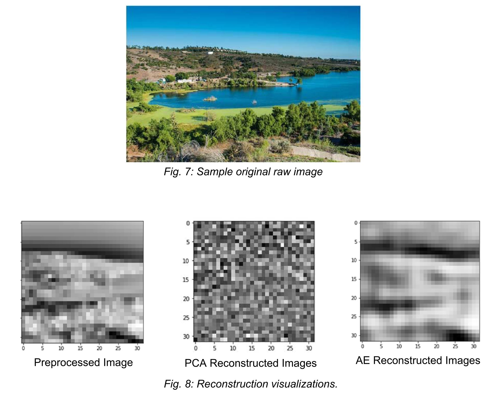

# 365Places Dataset Dimensional Reduction 
Dimension reduction methods comparison for large scale image classification.

[Term Project](https://10605.github.io/spring2020/#dimension-reduction-methods-for-image-classification) for [10605 Machine Learning for Large Scale Datasets](https://10605.github.io/spring2020/#dimension-reduction-methods-for-image-classification)  
Collaborated with: Jessica Zhu, Amy Lee, Anthony Wu

## Overview
In this project we compare the performance of 3 different dimension reduction techniques which can be deployed in a classification task pipeline. The three methods chosen are PCA, Kernel PCA, and Deep Autoencoder. We use PCA as a baseline to compare again the other two non-linear methods.

## Dataset
We tests our methods on the 365Places dataset, consisting of 1.8 million images (105 GB) of places that are evenly distributed among 365 categories.

## Evaluation:
- Runtime
- Memory Usage
- Reconstruction Error
- Scalability
- Classification Accuracy
- User-friendliness (number of parameters to tune)

## Implementation
The implementation was done using Google Cloud Platform, running Tensorflow on single instances and PySpark on a Dataproc cluster. We had initially implemented PCA and Kernel PCA in spark and autoencoder in tensorflow. But due to Tensorflow lacking native support in Spark, we had decided to move all training to Tensorflow for a consistent comparison. 

## Data Preprocessing
To avoid loading 100GB of data into memory, we rely on batch loading to simultaneously load, preprocess, and store the data on disk. Additionally we decided to reduce image dimensions to 32 by 32 with a single channel to speed up training. 

## Dimensional Reduction
Once the data is preprocessed, we stress-test the three methods to gauge the maximum amount of training data each can handle and obtain a comparison metrics. Based on that we train the best model for each methods.

Using trained model from each method, we performed dimensional reduction to N x 128 on the validation data. We then set up a classification pipeline on a dataproc cluster and train 4 separate logistic regression models: one on the unreduced data (as the controlled group), and 3 on the different dimension-reduced data obtained by the three methods. We then compare their classification performance.

## Result
### Scalability

While the autoencoder can handle the entire dataset of 1.8 millilon images, PCA and Kernel PCA can only process 500k and 50k images respectively.

### Complexity (Runtime)

PCA has the best performance, its runtime increase is almost undetectable in comparison to the other two methods. We hypothesize that the drastic increase in the Autoencoder’s runtime might be due to the fact that we could not take advantage of distributed batching.

### Complexity (Memory)

We measured the memory usage by recording the Resident Set Size (RSS), which is the amount of memory occupied by a process that is held in main memory before and after computation. We see relatively linear increases for both KPCA and Autoencoder. However, for unknown reason, we see a decrease in RSS for PCA, which we suppect might have been due to faults in our measurement and requires further investigation.

### Reconstruction Error

In reconstruction error, we see that Autoencoder is generally able to obtain a very low RMSE whereas PCA has higher RMSE. We did not plot RMSE for KPCA for its reconstruction is not straightforward.

### Classification Performance

We found that Autoencoder performs best, PCA performs about the same as the Autoencoder, and Kernel PCA achieves the worst result. None of the three reduction methods perform as well as the baseline, but this is expected since dimension-reduction causes a loss of information that could influence the prediction.

### User-friendliness
We measured the user-friendness in terms of the difficulty of model tuning. PCA has no parameters to tune while Kernel PCA only has one parameter (i.e. gamma, a parameter of the radial basis function). Autoencoder, on the other hand, have many parameters, for instance, the number of epochs, the optimization method, optimization algorithm, activation function, number of layers and size, etc. Hence we conclude that the Deep Autoencoder is the least user-friendly.

### Reconstruction Quality

We were surprised that the PCA performance was comparable to that of the Autoencoder despite its noise-like reconstruction, but we hypothesize that the reconstruction dissimilarity may be due to the fact that PCA and Autoencoder encode information differently.

### Cosine Similarity

We found that images reduced using PCA and Kernel PCA are more similar to each other than those of the Autoencoder. This differs slightly from our original expectations where we believed that Kernal PCA would captures non-linear features which PCA would not. Taking into account all results, we see that PCA and Autoencoder have different approaches to decomposing images but both can achieve satisfying results in the context of image classification.

## Conclusion
Overall, we concluded that PCA performs the best in terms of computation time, memory usage, and accuracy. However, the Deep Autoencoder appears to be the most scalable, and could be improved if we could determine a way to leverage a distributed system to reduce the computation time.

### [Read Full Report Here](https://github.com/v-machine/dim-reduction/blob/master/10605%20Final%20Report.pdf)
